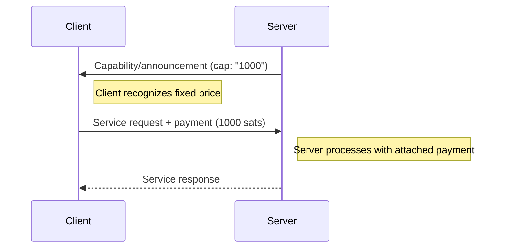
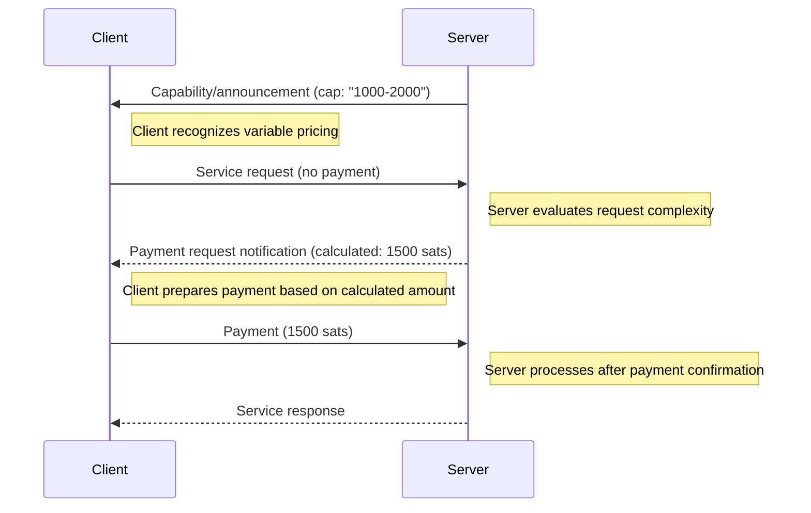
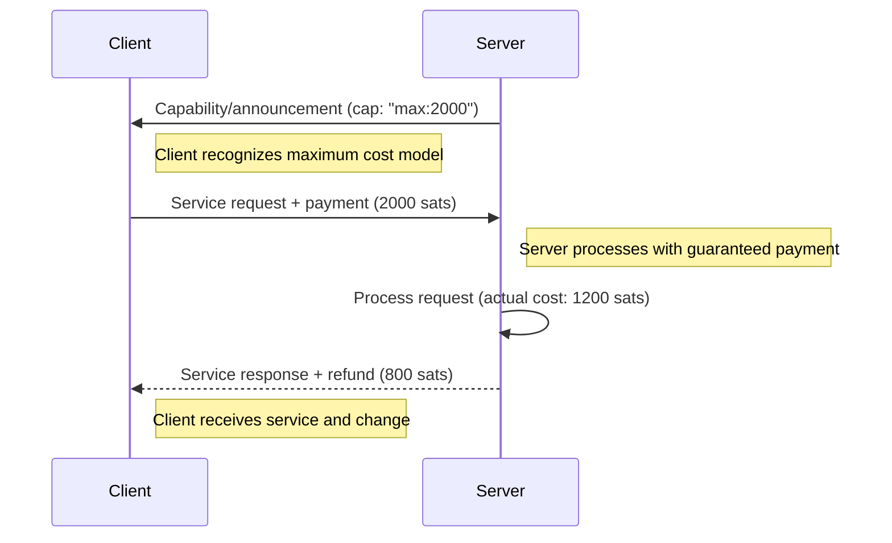

# Fixed vs Variable Pricing

This document describes the two primary client behavior patterns when interacting with servers that offer services with different pricing models.

## Pricing Methods

### 1. Fixed Price Request Flow

**Description:**
When the 'cap' tag in the server's capability or announcement event contains a single number (e.g., '1000'), this indicates a fixed price for the request. In this scenario, the client has complete pricing transparency upfront and can streamline the payment process.

**Key Characteristics:**

- **Predictable Cost:** The client knows the exact payment amount before making the request
- **Immediate Payment:** Payment can be attached directly to the initial service request
- **Efficient Process:** Single round-trip communication for request and payment
- **No Wait Time:** No need to wait for payment instructions from the server

**Use Cases:**

- Standard API calls with fixed rates
- Predefined service packages
- Simple computational tasks with known resource requirements

#### Fixed Price Flow Diagram

### 2. Variable Price Request Flow

**Description:**
When the 'cap' tag contains a range (e.g., '1000-2000'), it indicates that the final price will be determined after the server evaluates the specifics of the request. This dynamic pricing model requires a two-phase payment process and introduces significant complexity to the server-side implementation.

**Key Characteristics:**

- **Dynamic Pricing:** Final cost depends on request complexity or resource usage
- **Deferred Payment:** Client cannot pay until receiving the calculated amount
- **Two-Phase Process:** Separate request submission and payment phases
- **Server Evaluation:** Server must process the request to determine actual cost
- **⚠️ Complex Server Logic:** Server must implement sophisticated evaluation mechanisms to analyze request parameters, estimate resource requirements, and calculate fair pricing before processing begins

**Use Cases:**

- Complex computational tasks with variable resource requirements
- Content processing where cost depends on input size or complexity
- AI model inference where pricing varies by model size or processing time

#### Variable Price Flow Diagram

### 3. Maximum Cost with Refund Flow

**Description:**
In this hybrid approach, the server responds with a maximum cost estimate that the request cannot exceed. The client pays this maximum amount upfront, allowing immediate processing while ensuring fair pricing. After processing, if the actual resource usage was less than the maximum paid amount, the server returns the difference as change. This approach combines the efficiency of upfront payment with the fairness of usage-based pricing.

**Key Characteristics:**

- **Upfront Maximum Payment:** Client pays the estimated maximum cost immediately
- **Immediate Processing:** No waiting for cost calculation - processing begins right away
- **Fair Pricing:** Client only pays for actual resource usage
- **Automatic Refund:** Server returns overpayment as change
- **Risk Mitigation:** Protects both client (no surprise costs) and server (payment guaranteed)
- **Simplified Server Logic:** Less complex than full variable pricing since only upper bound estimation is needed

**Use Cases:**

- Services with unpredictable but bounded resource requirements
- Batch processing jobs where maximum resource usage can be estimated
- AI inference where model complexity varies but has known upper limits
- File processing where size determines cost but processing efficiency varies

#### Maximum Cost with Refund Flow Diagram

## Benefits and Trade-offs

| Aspect                | Fixed Price Flow                   | Variable Price Flow                      | Maximum Cost with Refund Flow                 |
| --------------------- | ---------------------------------- | ---------------------------------------- | --------------------------------------------- |
| **Simplicity**        | High - single interaction          | Medium - multiple phases                 | Medium - requires refund handling             |
| **Predictability**    | High - known cost upfront          | Low - cost varies                        | High - maximum cost known upfront             |
| **Efficiency**        | High - minimal round trips         | Medium - requires evaluation phase       | High - immediate processing                   |
| **Flexibility**       | Low - cannot adjust for complexity | High - fair pricing for resource usage   | High - pays only for actual usage             |
| **User Experience**   | Excellent - instant processing     | Good - requires wait for pricing         | Excellent - instant processing + fair pricing |
| **Server Complexity** | Low - no cost calculation needed   | High - sophisticated evaluation required | Medium - needs max estimation + refund logic  |
| **Payment Risk**      | None - fixed amount                | Low - amount within advertised range     | Medium - requires reliable refund mechanism   |
